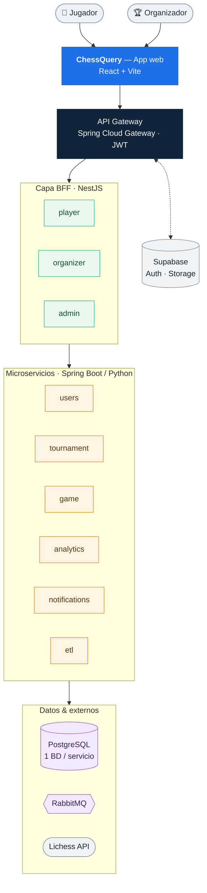

<div align="center">

# ♟️ ChessQuery

### Tu ajedrez, tus torneos, tu comunidad.

**La plataforma para jugar partidas en vivo, armar tus propios torneos y seguir tu progreso —
pensada para la escena de ajedrez casual y de club en Chile.**

<p>
  
  
  
  
  
  
  <br>
  
  
</p>

</div>

<details>
<summary><sub>📑 Tabla de contenidos</sub></summary>

- [¿Qué es ChessQuery?](#qué-es-chessquery)
- [¿Qué puedes hacer?](#-qué-puedes-hacer)
- [Estado del proyecto](#-estado-del-proyecto)
- [Work in progress](#-work-in-progress)
- [Para el equipo técnico](#-para-el-equipo-técnico)
  - [Arquitectura y componentes](#-arquitectura-y-componentes)
  - [Arrancar todo (Docker)](#️-arrancar-todo-docker)
  - [Documentación clave](#-documentación-clave)
  - [Equipo](#-equipo)

</details>

---

## ¿Qué es ChessQuery?

**ChessQuery es una plataforma web de ajedrez competitivo.** La idea es simple: que cualquier
persona —desde el que juega los domingos en la plaza hasta un club que organiza su liga— tenga un
lugar para **jugar, competir y mejorar**, sin la fricción de las plataformas gigantes.

Te creas una cuenta, eliges si entras como **jugador** o como **organizador**, y desde ahí:

- 🎮 **Juegas partidas en vivo** sobre un tablero moderno, viendo cada movimiento en tiempo real.
- 🏆 **Armas tus propios torneos** (o te inscribes en los de otros) con formatos de verdad: Suizo,
  Round-Robin o eliminación directa.
- 📈 **Sigues tu progreso** con tu ELO, tu historial de partidas y tus estadísticas.
- 🌍 **Conectas tu cuenta de Lichess** para traer tus ratings oficiales por modalidad.

No es una app para mirar — es para **competir y construir comunidad**.

---

## ✨ ¿Qué puedes hacer?

### 🎮 Como jugador
- **Partidas en vivo** sobre un tablero limpio y moderno (estilo *en-croissant*), con seguimiento
  jugada a jugada.
- **Inscríbete en torneos** abiertos con un par de clics.
- **Tu perfil y tu progreso**: ELO actualizado automáticamente tras cada partida, historial completo
  y estadísticas de tu juego.
- **Ratings reales de Lichess**: vincula tu cuenta y muestra tus ratings oficiales por modalidad
  (bullet, blitz, rápido, clásico).
- **Descarga tus partidas en PGN** para analizarlas donde quieras.
- **Ranking nacional** por categoría y búsqueda de jugadores tolerante a errores de tipeo.

### 🏆 Como organizador
- **Crea torneos** eligiendo formato (Suizo / Round-Robin / Knockout), fechas y cupos.
- **Gestiona inscripciones** y valida a los participantes.
- **Genera emparejamientos** ronda por ronda y **registra resultados** sin planillas a mano.
- **Tabla de posiciones automática** con desempates reales (Buchholz, Sonneborn-Berger).
- Panel dedicado para llevar tu competencia de principio a fin.

### 🔔 Y de fondo, la plataforma trabaja sola
- Cálculo automático de ELO, notificaciones por correo (bienvenida, invitaciones, inicio de ronda)
  y sincronización con fuentes externas — todo ocurriendo entre bastidores.

---

## 📌 Estado del proyecto

🎓 **Proyecto académico — Desarrollo Fullstack III (DSY1106, DuocUC).**

ChessQuery está **en desarrollo activo**. Lo que ves hoy es la **demo actual** del proyecto,
funcionando de punta a punta — todavía con piezas por terminar y pulir:

- ✅ **Flujo principal funcionando** — registro, partidas en vivo entre cuentas, torneos y
  notificaciones, corriendo sobre Docker + Supabase.
- ✅ **Desplegada en AWS** — en la nube (ECS Fargate + RDS + S3 + ALB), verificada de registro a
  partida. Ver [`docs/DESPLIEGUE_REPLICA_AWS.md`](./docs/DESPLIEGUE_REPLICA_AWS.md).
- ✅ **Integración con Lichess** — sincronización de ratings oficiales por modalidad.
- ✅ **~530 pruebas automatizadas** (Java + BFFs + Frontend) y CI en GitHub Actions.
- 🔜 **En curso** — analítica/ETL, HTTPS público vía CloudFront y mejoras de UX, entre otras cosas.

## 🚧 Work in progress

ChessQuery nace como trabajo universitario, pero la visión va mucho más allá de la nota. Se sigue
construyendo, con la idea de que más adelante **salga a la luz como una plataforma real** para la
comunidad ajedrecística.

Algunas cosas se están cocinando en silencio. 🤫
*Quédate atento.*

---
---

# 🧑‍💻 Para el equipo técnico

A partir de aquí, los detalles de arquitectura, ejecución y documentación.

## 🧩 Arquitectura y componentes

ChessQuery está construido sobre una **arquitectura de microservicios**: cada dominio (usuarios,
torneos, partidas, analítica, notificaciones) vive en su propio servicio con su base de datos,
detrás de un API Gateway y capas BFF (*Backend For Frontend*) por rol. La comunicación asíncrona va
por **RabbitMQ**, la autenticación y el storage por **Supabase**.



| Componente | Tipo | Puerto | Stack |
|---|---|---|---|
| Supabase Auth + Storage | externo | 54321 | Supabase |
| [ms-users](./ms-users) | microservicio | 8081 | Spring Boot 3.2.4 |
| [ms-tournament](./ms-tournament) | microservicio | 8082 | Spring Boot 3.2.4 |
| [ms-game](./ms-game) | microservicio | 8083 | Spring Boot 3.2.4 |
| [ms-analytics](./ms-analytics) | microservicio | 8084 | Spring Boot 3.2.4 |
| [ms-notifications](./ms-notifications) | microservicio | 8085 | Spring Boot 3.2.4 |
| [ms-etl](./ms-etl) | microservicio (Lichess) | 8086 | Python 3.11 + FastAPI |
| [api-gateway](./api-gateway) | gateway | 8080 | Spring Cloud Gateway |
| [bff-player](./bff-player) | BFF | 3001 | NestJS 10 |
| [bff-organizer](./bff-organizer) | BFF | 3002 | NestJS 10 |
| [bff-admin](./bff-admin) | BFF | 3003 | NestJS 10 |
| [frontend/apps/chess-portal](./frontend/apps/chess-portal) | SPA jugador | 5173 | React 18 + Vite |
| [frontend/apps/organizer-panel](./frontend/apps/organizer-panel) | SPA organizador | 5174 | React 18 + Vite |
| [archetypes/chessquery-ms-archetype](./archetypes/chessquery-ms-archetype) | arquetipo Maven | — | Maven 3.9 |

> **Nota (2026-05):** stack migrado a Supabase Auth + Supabase Storage.
> MS-Auth, `auth_db` y MinIO removidos. Setup: [docs/SUPABASE_SETUP.md](./docs/SUPABASE_SETUP.md).
> El estado pre-migración es recuperable desde el commit `0fb84d5`.

## ⚙️ Arrancar todo (Docker)

```bash
# Desarrollo (todos los servicios)
cd infrastructure && make up

# Demo en equipos con poca RAM (override JVM + apaga out-of-scope)
cd infrastructure && make demo-up

# 5 min antes de la demo: health check completo
make preflight
```

Frontend (monorepo NPM): `npm run dev:portal` (5173) y `npm run dev:organizer` (5174).

## 📚 Documentación clave

> 📖 Índice completo en [`docs/README.md`](./docs/README.md).

| Doc | Contenido |
|---|---|
| [`docs/ANALISIS_PATRONES.md`](./docs/ANALISIS_PATRONES.md) | 8 patrones de diseño + 6 arquitectónicos + arquetipo Maven |
| [`docs/IMPLEMENTACION.md`](./docs/IMPLEMENTACION.md) | Arquitectura general capa por capa |
| [`docs/CONTEXT.md`](./docs/CONTEXT.md) | ERD completo, contratos REST, eventos |
| [`docs/specs/HISTORIAS_USUARIO.md`](./docs/specs/HISTORIAS_USUARIO.md) | Historias de usuario (qué hace, para quién, bajo qué reglas) |
| [`TESTING.md`](./TESTING.md) | Comandos para correr los ~530 tests (Java + BFFs + Frontend) |
| [`docs/PRUEBAS.md`](./docs/PRUEBAS.md) | Estrategia y detalle de pruebas (unitarias e integración, JaCoCo) |
| [`docs/DESPLIEGUE_REPLICA_AWS.md`](./docs/DESPLIEGUE_REPLICA_AWS.md) | Despliegue y operación de la réplica en AWS |
| [`infrastructure/aws/RUNBOOK_ECS.md`](./infrastructure/aws/RUNBOOK_ECS.md) | Runbook ECS Fargate paso a paso |
| [`docs/SECURITY_PLAN.md`](./docs/SECURITY_PLAN.md) | Auditoría de seguridad + plan de hardening |
| [`docs/ORAL_DEFENSE_CHEAT_SHEET.md`](./docs/ORAL_DEFENSE_CHEAT_SHEET.md) | Argumentos clave para la defensa oral |
| [`docs/specs/SPEC_LEY21719.md`](./docs/specs/SPEC_LEY21719.md) | Cumplimiento Ley 21.719 |
| [`docs/README-WINDOWS.md`](./docs/README-WINDOWS.md) | Setup en Windows con `setup.ps1` |

## 👥 Equipo

**Asignatura:** DSY1106 Desarrollo Fullstack III — DuocUC.
**Equipo:** Martín Mora, Agustín Garrido, Gabriel Espinoza.

## 🛠️ Desarrollo

Ver el README de cada componente para instrucciones específicas.
